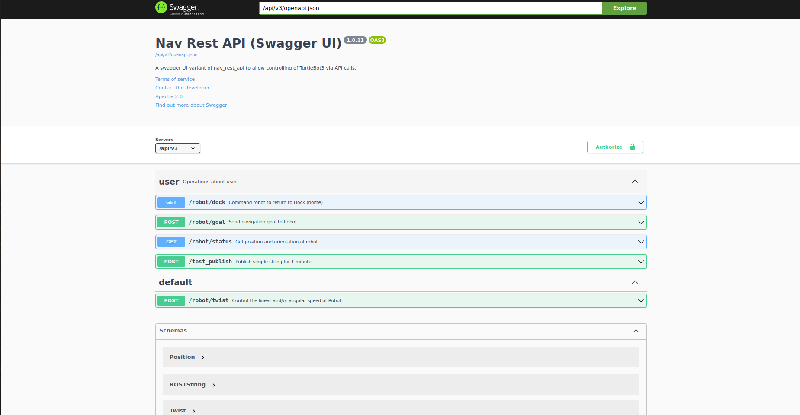

## **What Is This?**

This repository contains an API server implementation using Swagger UI and aimed at providing REST API calls that can interact with a simulated TurtleBot3 in `nav_rest_api_turtlebot3`.

## **Build** :hammer:

```bash
docker build -t swagger_server .
```

## **Run**

```bash
docker run --rm -it \
    --network=host \
    --name swagger_server_c \
swagger_server bash -c "roslaunch nav_rest_api server.launch"
```

## **Verify** :white_check_mark:

You should see the following webpage open on your browser:



The terminal should then output something similar to below:

```bash
... logging to /root/.ros/log/2f490db4-83bf-11ef-adae-44032cc92b56/roslaunch-rosi-0-1.log
Checking log directory for disk usage. This may take a while.
Press Ctrl-C to interrupt
Done checking log file disk usage. Usage is <1GB.

started roslaunch server http://rosi-0:33773/

SUMMARY
========

PARAMETERS
 * /rosdistro: noetic
 * /rosversion: 1.16.0

NODES
  /
    nav_rest_api (nav_rest_api/run_server.bash)

auto-starting new master
process[master]: started with pid [50]
ROS_MASTER_URI=http://localhost:11311

setting /run_id to 2f490db4-83bf-11ef-adae-44032cc92b56
process[rosout-1]: started with pid [60]
started core service [/rosout]
process[nav_rest_api-2]: started with pid [63]
/catkin_ws/src/nav_rest_api/swagger_server/__main__.py:10: DeprecationWarning: 'app.json_encoder' is deprecated and will be removed in Flask 2.3. Customize 'app.json_provider_class' or 'app.json' instead.
  app.app.json_encoder = encoder.JSONEncoder
 * Serving Flask app '__main__'
 * Debug mode: off
WARNING: This is a development server. Do not use it in a production deployment. Use a production WSGI server instead.
 * Running on all addresses (0.0.0.0)
 * Running on http://127.0.0.1:8080
 * Running on http://192.168.50.173:8080
Press CTRL+C to quit

```

